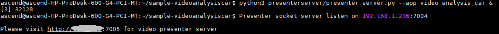

中文|[英文](README.md)

开发者将本Application部署至Atlas 200 DK或者AI加速云服务器上实现对本地mp4文件或者RTSP视频流进行解码，对视频帧中的车辆并对其属性进行预测，生成结构化信息发送至Server端进行保存、展示的功能。

## 前提条件<a name="zh-cn_topic_0167339279_section137245294533"></a>

部署此Sample前，需要准备好以下环境：

-   已完成MindStudio的安装，详细请参考[Mind Studio安装指南](https://www.huawei.com/minisite/ascend/cn/filedetail_1.html)。
-   已完成Atlas 200 DK开发者板与Mind Studio的连接，交叉编译器的安装，SD卡的制作及基本信息的配置等，详细请参考[Atlas 200 DK使用指南](https://www.huawei.com/minisite/ascend/cn/filedetail_2.html)。

## 软件准备<a name="zh-cn_topic_0167339279_section8534138124114"></a>

运行此Sample前，需要按照此章节获取源码包，并进行相关的环境配置。

1.  获取源码包。

    将[https://github.com/Ascend/sample-videoanalysiscar](https://github.com/Ascend/sample-videoanalysiscar)仓中的代码以Mind Studio安装用户下载至Mind Studio所在Ubuntu服务器的任意目录，例如代码存放路径为：_/home/ascend/sample-videoanalysiscar_。

2.  以Mind Studio安装用户登录Mind Studio所在Ubuntu服务器，并设置环境变量DDK\_HOME。

    **vim \~/.bashrc**

    执行如下命令在最后一行添加DDK\_HOME及LD\_LIBRARY\_PATH的环境变量。

    **export DDK\_HOME=/home/XXX/tools/che/ddk/ddk**

    **export LD\_LIBRARY\_PATH=$DDK\_HOME/uihost/lib**

    > **说明：**   
    >-   XXX为Mind Studio安装用户，/home/XXX/tools为DDK默认安装路径。  
    >-   如果此环境变量已经添加，则此步骤可跳过。  

    输入:wq!保存退出。

    执行如下命令使环境变量生效。

    **source \~/.bashrc**


## 部署<a name="zh-cn_topic_0167339279_section1759513564117"></a>

1.  以Mind Studio安装用户进入videoanalysis应用代码所在根目录，如_**/home/ascend/sample-videoanalysiscar**_。
2.  <a name="zh-cn_topic_0167339279_li08019112542"></a>执行部署脚本，进行工程环境准备，包括ascenddk公共库的编译与部署、网络模型的下载、Presenter Server服务器的配置等操作。

    **bash deploy.sh** _host\_ip_ _model\_mode_

    -   _host\_ip_：对于Atlas 200 DK开发者板，即为开发者板的IP地址。对于AI加速云服务器，即为Host侧的IP地址。

    -   model\_mode代表模型文件的部署方式，默认为internet。
        -   local：若Mind Studio所在Ubuntu系统未连接网络，请使用local模式，执行此命令前，需要参考[网络模型及依赖代码库下载](#zh-cn_topic_0167339279_section13807155164319)将模型文件及依赖代码库的下载到“/sample-videoanalysiscar/script“目录下。
        -   internet：若Mind Studio所在Ubuntu系统已连接网络，请使用internet模式，在线下载模型文件及依赖代码库的下载。


    命令示例：

    **bash deploy.sh 192.168.1.2 internet**

    -   当提示“Please choose one to show the presenter in browser\(default: 127.0.0.1\):“时，请输入在浏览器中访问Presenter Server服务所使用的IP地址（一般为访问Mind Studio的IP地址）。
    -   当提示“Please input a absolute path to storage video analysis data:“时，请输入Mind Studio中已存在的绝对路径用于存储视频解析数据，此路径Mind Studio用户需要有读写权限。

    如[图1](#zh-cn_topic_0167339279_fig184321447181017)所示，请在“Current environment valid ip list“中选择通过浏览器访问Presenter Server服务使用的IP地址，并输入存储视频解析数据的路径。

    **图 1**  工程部署示意图<a name="zh-cn_topic_0167339279_fig184321447181017"></a>  
    

3.  <a name="zh-cn_topic_0167339279_li499911453439"></a>启动Presenter Server。

    执行如下命令在后台启动Video Analysis应用的Presenter Server主程序。

    **python3 presenterserver/presenter\_server.py --app video\_analysis\_car &**

    > **说明：**   
    >“presenter\_server.py“在当前目录的“presenterserver“目录下，可以在此目录下执行**python3 presenter\_server.py -h**或者**python3 presenter\_server.py --help**查看“presenter\_server.py“的使用方法。  

    如[图2](#zh-cn_topic_0167339279_fig69531305324)所示，表示presenter\_server的服务启动成功。

    **图 2**  Presenter Server进程启动<a name="zh-cn_topic_0167339279_fig69531305324"></a>  
    

    使用上图提示的URL登录Presenter Server，仅支持Chrome浏览器，IP地址为[2](#zh-cn_topic_0167339279_li08019112542)中输入的IP地址，端口号默为7005，如下图所示，表示Presenter Server启动成功。

    **图 3**  主页显示<a name="zh-cn_topic_0167339279_fig64391558352"></a>  
    

4.  视频结构化应用支持解析本地视频和RTSP视频流。
    -   如果需要解析本地视频，需要将视频文件传到Host侧。

        例如将视频文件car.mp4上传到Host侧的“/home/HwHiAiUser/sample“目录下。

        > **说明：**   
        >支持H264与H265格式的MP4文件，如果MP4文件需要剪辑，建议使用开源工具ffmpeg，使用其他工具剪辑的视频文件ffmpeg工具可能不支持解析。  

    -   如果仅解析RTSP视频流，本步骤可跳过。


## 运行<a name="zh-cn_topic_0167339279_section6245151616426"></a>

1.  运行Video Analysis程序。

    在“/home/ascend/sample-videoanalysiscar“目录下执行如下命令运行Video Analysis应用程序。

    **bash run\_videoanalysiscarapp.sh** _host\_ip_ _presenter\_view\_appname_  _channel1_ _\[channel2\]_   &

    -   _host\_ip_：对于Atlas 200 DK开发者板，即为开发者板的IP地址。对于AI加速云服务器，即为Host侧的IP地址。
    -   _presenter\_view\_app\_name_：用户自定义的在PresenterServer界面展示的View Name。
    -   _channel1_：为Host侧的视频文件的绝对路径。
    -   _channel2_：为RTSP视频流的URL。

    命令示例如下所示：

    **bash run\_videoanalysiscarapp.sh 192.168.1.2 video /home/HwHiAiUser/sample/car.mp4 &**

2.  使用启动Presenter Server服务时提示的URL登录 Presenter Server 网站（仅支持Chrome浏览器），详细可参考[3](#zh-cn_topic_0167339279_li499911453439)。

    > **说明：**   
    >Video Analysis的Presenter Server最多支持2个_presenter\_view\_app\_name_同时显示。  

    页面左侧树结构列出了视频所属app name以及通道名，中间列出了抽取的视频帧大图以及检测出的目标小图，点击下方小图后会在右侧列出详细的推理结果、评分。

    本应用支持车辆属性检测，包括车辆品牌、车辆颜色的识别和车牌号码识别。

    > **说明：**   
    >车牌号码识别的网络模型，是通过程序自动生成的车牌作为训练集图片训练的，不是使用真实车牌图片训练的。所以该模型在识别真实车牌号码时准确度比较低，如果需要较高的准确度的模型，请自己搜集真实车牌图片作为训练集并训练。  


## 后续处理<a name="zh-cn_topic_0167339279_section1092612277429"></a>

-   **停止视频结构化应用**

    若要停止视频结构化应用程序，可执行如下操作。

    以Mind Studio安装用户在sample-videoanalysiscar目录下执行如下命令：

    **bash stop\_videoanalysiscarapp.sh** _host\_ip_

    _host\_ip：_对于Atlas 200 DK开发者板，即为开发者板的IP地址。对于AI加速云服务器，即为Host的IP地址。。

    命令示例：

    **bash stop\_videoanalysiscarapp.sh** _192.168.1.2_

-   **停止Presenter Server服务**

    Presenter Server服务启动后会一直处于运行状态，若想停止视频结构化应用对应的Presenter Server服务，可执行如下操作。

    以Mind Studio安装用户在Mind Studio所在服务器中执行如下命令查看视频结构化应用对应的Presenter Server服务的进程。

    **ps -ef | grep presenter | grep video\_analysis\_car**

    ```
    ascend@ascend-HP-ProDesk-600-G4-PCI-MT:~/sample-videoanalysiscar$ ps -ef | grep presenter | grep video_analysis_car
    ascend 3655 20313 0 15:10 pts/24?? 00:00:00 python3 presenterserver/presenter_server.py --app video_analysis_car
    ```

    如上所示_3655_即为车辆检测应用对应的Presenter Server服务的进程ID。

    若想停止此服务，执行如下命令：

    **kill -9** _3655_


## 网络模型及依赖代码库下载<a name="zh-cn_topic_0167339279_section13807155164319"></a>

-   网络模型文件下载

    车辆检测Application中使用的模型是经过转化后的适配Ascend 310芯片的模型，适配Ascend 310的模型的下载及原始网络模型的下载可参考[表1](#zh-cn_topic_0167339279_table0531392153)。如果您有更好的模型，欢迎上传到[https://github.com/Ascend/models](https://github.com/Ascend/models)进行分享。

    将模型文件（.om文件）下载到“sample-videoanalysiscar/script“目录下。

    **表 1**  开源Application中使用模型

    <a name="zh-cn_topic_0167339279_table0531392153"></a>
    <table><thead align="left"><tr id="zh-cn_topic_0167339279_row1154103991514"><th class="cellrowborder" valign="top" width="19.53%" id="mcps1.2.5.1.1"><p id="zh-cn_topic_0167339279_p195418397155"><a name="zh-cn_topic_0167339279_p195418397155"></a><a name="zh-cn_topic_0167339279_p195418397155"></a>模型名称</p>
    </th>
    <th class="cellrowborder" valign="top" width="29.970000000000002%" id="mcps1.2.5.1.2"><p id="zh-cn_topic_0167339279_p1054539151519"><a name="zh-cn_topic_0167339279_p1054539151519"></a><a name="zh-cn_topic_0167339279_p1054539151519"></a>模型说明</p>
    </th>
    <th class="cellrowborder" valign="top" width="32.01%" id="mcps1.2.5.1.3"><p id="zh-cn_topic_0167339279_p387083117108"><a name="zh-cn_topic_0167339279_p387083117108"></a><a name="zh-cn_topic_0167339279_p387083117108"></a>模型下载路径</p>
    </th>
    <th class="cellrowborder" valign="top" width="18.490000000000002%" id="mcps1.2.5.1.4"><p id="zh-cn_topic_0167339279_p35412397154"><a name="zh-cn_topic_0167339279_p35412397154"></a><a name="zh-cn_topic_0167339279_p35412397154"></a>原始网络下载地址</p>
    </th>
    </tr>
    </thead>
    <tbody><tr id="zh-cn_topic_0167339279_row12294113715478"><td class="cellrowborder" valign="top" width="19.53%" headers="mcps1.2.5.1.1 "><p id="zh-cn_topic_0167339279_p1829517371475"><a name="zh-cn_topic_0167339279_p1829517371475"></a><a name="zh-cn_topic_0167339279_p1829517371475"></a>车辆颜色识别模型</p>
    <p id="zh-cn_topic_0167339279_p9548649134712"><a name="zh-cn_topic_0167339279_p9548649134712"></a><a name="zh-cn_topic_0167339279_p9548649134712"></a>（car_color.om）</p>
    </td>
    <td class="cellrowborder" valign="top" width="29.970000000000002%" headers="mcps1.2.5.1.2 "><p id="zh-cn_topic_0167339279_p52721094817"><a name="zh-cn_topic_0167339279_p52721094817"></a><a name="zh-cn_topic_0167339279_p52721094817"></a>-</p>
    </td>
    <td class="cellrowborder" valign="top" width="32.01%" headers="mcps1.2.5.1.3 "><p id="zh-cn_topic_0167339279_p1851910895211"><a name="zh-cn_topic_0167339279_p1851910895211"></a><a name="zh-cn_topic_0167339279_p1851910895211"></a>请从<a href="https://github.com/Ascend/models/" target="_blank" rel="noopener noreferrer">https://github.com/Ascend/models/</a>仓的computer_vision/classification/<span>car_color</span>目录中下载。</p>
    <p id="zh-cn_topic_0167339279_p652158105210"><a name="zh-cn_topic_0167339279_p652158105210"></a><a name="zh-cn_topic_0167339279_p652158105210"></a>对应版本说明请参考当前目录下的<span>README.md</span>文件。</p>
    </td>
    <td class="cellrowborder" valign="top" width="18.490000000000002%" headers="mcps1.2.5.1.4 "><p id="zh-cn_topic_0167339279_p044110435414"><a name="zh-cn_topic_0167339279_p044110435414"></a><a name="zh-cn_topic_0167339279_p044110435414"></a>请参考<a href="https://github.com/Ascend/models/" target="_blank" rel="noopener noreferrer">https://github.com/Ascend/models/</a>仓的computer_vision/classification/<span>car_color</span>目录下的<span>README.md</span>文件获取。</p>
    <p id="zh-cn_topic_0167339279_p7616134512126"><a name="zh-cn_topic_0167339279_p7616134512126"></a><a name="zh-cn_topic_0167339279_p7616134512126"></a><strong id="zh-cn_topic_0167339279_b166271256121218"><a name="zh-cn_topic_0167339279_b166271256121218"></a><a name="zh-cn_topic_0167339279_b166271256121218"></a>模型转换时注意事项：</strong></p>
    <p id="zh-cn_topic_0167339279_p645105161215"><a name="zh-cn_topic_0167339279_p645105161215"></a><a name="zh-cn_topic_0167339279_p645105161215"></a>car_color_inference一次处理10张图片，所以转换时需要将Input Shape的N修改为10。</p>
    </td>
    </tr>
    <tr id="zh-cn_topic_0167339279_row12346165423420"><td class="cellrowborder" valign="top" width="19.53%" headers="mcps1.2.5.1.1 "><p id="zh-cn_topic_0167339279_p196801340352"><a name="zh-cn_topic_0167339279_p196801340352"></a><a name="zh-cn_topic_0167339279_p196801340352"></a>车辆品牌识别模型（car_type.om）</p>
    </td>
    <td class="cellrowborder" valign="top" width="29.970000000000002%" headers="mcps1.2.5.1.2 "><p id="zh-cn_topic_0167339279_p068011433519"><a name="zh-cn_topic_0167339279_p068011433519"></a><a name="zh-cn_topic_0167339279_p068011433519"></a>基于Caffe的GoogleNet模型。</p>
    </td>
    <td class="cellrowborder" valign="top" width="32.01%" headers="mcps1.2.5.1.3 "><p id="zh-cn_topic_0167339279_p7947935125417"><a name="zh-cn_topic_0167339279_p7947935125417"></a><a name="zh-cn_topic_0167339279_p7947935125417"></a>请从<a href="https://github.com/Ascend/models/" target="_blank" rel="noopener noreferrer">https://github.com/Ascend/models/</a>仓的computer_vision/classification/<span>car_type</span>目录中下载。</p>
    <p id="zh-cn_topic_0167339279_p4947173535413"><a name="zh-cn_topic_0167339279_p4947173535413"></a><a name="zh-cn_topic_0167339279_p4947173535413"></a>对应版本说明请参考当前目录下的<span>README.md</span>文件。</p>
    </td>
    <td class="cellrowborder" valign="top" width="18.490000000000002%" headers="mcps1.2.5.1.4 "><p id="zh-cn_topic_0167339279_p57018652210"><a name="zh-cn_topic_0167339279_p57018652210"></a><a name="zh-cn_topic_0167339279_p57018652210"></a>请参考<a href="https://github.com/Ascend/models/" target="_blank" rel="noopener noreferrer">https://github.com/Ascend/models/</a>仓的computer_vision/classification/<span>car_type</span>目录下的<span>README.md</span>文件获取。</p>
    <p id="zh-cn_topic_0167339279_p1994592941515"><a name="zh-cn_topic_0167339279_p1994592941515"></a><a name="zh-cn_topic_0167339279_p1994592941515"></a><strong id="zh-cn_topic_0167339279_b13946182919155"><a name="zh-cn_topic_0167339279_b13946182919155"></a><a name="zh-cn_topic_0167339279_b13946182919155"></a>模型转换时注意事项：</strong></p>
    <p id="zh-cn_topic_0167339279_p12946229111515"><a name="zh-cn_topic_0167339279_p12946229111515"></a><a name="zh-cn_topic_0167339279_p12946229111515"></a>car_type_inference一次处理10张图片，所以转换时需要将Input Shape的N修改为10。</p>
    </td>
    </tr>
    <tr id="zh-cn_topic_0167339279_row12462681048"><td class="cellrowborder" valign="top" width="19.53%" headers="mcps1.2.5.1.1 "><p id="zh-cn_topic_0167339279_p7463128346"><a name="zh-cn_topic_0167339279_p7463128346"></a><a name="zh-cn_topic_0167339279_p7463128346"></a>车牌检测网络模型（car_plate_detection.om）</p>
    </td>
    <td class="cellrowborder" valign="top" width="29.970000000000002%" headers="mcps1.2.5.1.2 "><p id="zh-cn_topic_0167339279_p445385961"><a name="zh-cn_topic_0167339279_p445385961"></a><a name="zh-cn_topic_0167339279_p445385961"></a>基于Caffe的Mobilenet-SSD模型。</p>
    </td>
    <td class="cellrowborder" valign="top" width="32.01%" headers="mcps1.2.5.1.3 "><p id="zh-cn_topic_0167339279_p108303405132"><a name="zh-cn_topic_0167339279_p108303405132"></a><a name="zh-cn_topic_0167339279_p108303405132"></a>请从<a href="https://github.com/Ascend/models/" target="_blank" rel="noopener noreferrer">https://github.com/Ascend/models/</a>仓的computer_vision/object_detect/<span>car_plate_detection</span>目录中下载。</p>
    <p id="zh-cn_topic_0167339279_p12830144015137"><a name="zh-cn_topic_0167339279_p12830144015137"></a><a name="zh-cn_topic_0167339279_p12830144015137"></a>对应版本说明请参考当前目录下的<span>README.md</span>文件。</p>
    </td>
    <td class="cellrowborder" valign="top" width="18.490000000000002%" headers="mcps1.2.5.1.4 "><p id="zh-cn_topic_0167339279_p1446358844"><a name="zh-cn_topic_0167339279_p1446358844"></a><a name="zh-cn_topic_0167339279_p1446358844"></a>请参考<a href="https://github.com/Ascend/models/" target="_blank" rel="noopener noreferrer">https://github.com/Ascend/models/</a>仓的computer_vision/object_detect/<span>car_plate_detection</span>目录下的<span>README.md</span>文件获取。</p>
    <p id="zh-cn_topic_0167339279_p177156532915"><a name="zh-cn_topic_0167339279_p177156532915"></a><a name="zh-cn_topic_0167339279_p177156532915"></a><strong id="zh-cn_topic_0167339279_b127155518299"><a name="zh-cn_topic_0167339279_b127155518299"></a><a name="zh-cn_topic_0167339279_b127155518299"></a>模型转换时注意事项：</strong></p>
    <p id="zh-cn_topic_0167339279_p177159582910"><a name="zh-cn_topic_0167339279_p177159582910"></a><a name="zh-cn_topic_0167339279_p177159582910"></a>转化时会提示转化失败，只需要在最后一层的下拉框中选择SSDDetectionOutput然后点击Retry重新转换即可。</p>
    <p id="zh-cn_topic_0167339279_p1554781844620"><a name="zh-cn_topic_0167339279_p1554781844620"></a><a name="zh-cn_topic_0167339279_p1554781844620"></a><a name="zh-cn_topic_0167339279_image129011919184618"></a><a name="zh-cn_topic_0167339279_image129011919184618"></a><span></span></p>
    </td>
    </tr>
    <tr id="zh-cn_topic_0167339279_row1438610219151"><td class="cellrowborder" valign="top" width="19.53%" headers="mcps1.2.5.1.1 "><p id="zh-cn_topic_0167339279_p1386921161513"><a name="zh-cn_topic_0167339279_p1386921161513"></a><a name="zh-cn_topic_0167339279_p1386921161513"></a>车牌号码识别网络模型（car_plate_recognition.om）</p>
    </td>
    <td class="cellrowborder" valign="top" width="29.970000000000002%" headers="mcps1.2.5.1.2 "><p id="zh-cn_topic_0167339279_p149446575155"><a name="zh-cn_topic_0167339279_p149446575155"></a><a name="zh-cn_topic_0167339279_p149446575155"></a>基于Caffe的CNN模型。</p>
    </td>
    <td class="cellrowborder" valign="top" width="32.01%" headers="mcps1.2.5.1.3 "><p id="zh-cn_topic_0167339279_p143886814161"><a name="zh-cn_topic_0167339279_p143886814161"></a><a name="zh-cn_topic_0167339279_p143886814161"></a>请从<a href="https://github.com/Ascend/models/" target="_blank" rel="noopener noreferrer">https://github.com/Ascend/models/</a>仓的computer_vision/classification/<span>car_plate_recognition</span>目录中下载。</p>
    <p id="zh-cn_topic_0167339279_p1238898191617"><a name="zh-cn_topic_0167339279_p1238898191617"></a><a name="zh-cn_topic_0167339279_p1238898191617"></a>对应版本说明请参考当前目录下的<span>README.md</span>文件。</p>
    </td>
    <td class="cellrowborder" valign="top" width="18.490000000000002%" headers="mcps1.2.5.1.4 "><p id="zh-cn_topic_0167339279_p15386142113152"><a name="zh-cn_topic_0167339279_p15386142113152"></a><a name="zh-cn_topic_0167339279_p15386142113152"></a>请参考<a href="https://github.com/Ascend/models/" target="_blank" rel="noopener noreferrer">https://github.com/Ascend/models/</a>仓的computer_vision/object_detect/<span>car_plate_recognition</span>目录下的<span>README.md</span>文件获取。</p>
    </td>
    </tr>
    <tr id="zh-cn_topic_0167339279_row15233104034916"><td class="cellrowborder" valign="top" width="19.53%" headers="mcps1.2.5.1.1 "><p id="zh-cn_topic_0167339279_p671932965015"><a name="zh-cn_topic_0167339279_p671932965015"></a><a name="zh-cn_topic_0167339279_p671932965015"></a>目标检测网络模型</p>
    <p id="zh-cn_topic_0167339279_p267913419353"><a name="zh-cn_topic_0167339279_p267913419353"></a><a name="zh-cn_topic_0167339279_p267913419353"></a>（vgg_ssd.om）</p>
    </td>
    <td class="cellrowborder" valign="top" width="29.970000000000002%" headers="mcps1.2.5.1.2 "><p id="zh-cn_topic_0167339279_p1668310475389"><a name="zh-cn_topic_0167339279_p1668310475389"></a><a name="zh-cn_topic_0167339279_p1668310475389"></a>基于Caffe的SSD512模型。</p>
    </td>
    <td class="cellrowborder" valign="top" width="32.01%" headers="mcps1.2.5.1.3 "><p id="zh-cn_topic_0167339279_p384510355555"><a name="zh-cn_topic_0167339279_p384510355555"></a><a name="zh-cn_topic_0167339279_p384510355555"></a>请从<a href="https://github.com/Ascend/models/" target="_blank" rel="noopener noreferrer">https://github.com/Ascend/models/</a>仓的computer_vision/object_detect/vgg_ssd目录中下载。</p>
    <p id="zh-cn_topic_0167339279_p13845123525511"><a name="zh-cn_topic_0167339279_p13845123525511"></a><a name="zh-cn_topic_0167339279_p13845123525511"></a>对应版本说明请参考当前目录下的<span>README.md</span>文件。</p>
    </td>
    <td class="cellrowborder" valign="top" width="18.490000000000002%" headers="mcps1.2.5.1.4 "><p id="zh-cn_topic_0167339279_p18846153545510"><a name="zh-cn_topic_0167339279_p18846153545510"></a><a name="zh-cn_topic_0167339279_p18846153545510"></a>请参考<a href="https://github.com/Ascend/models/" target="_blank" rel="noopener noreferrer">https://github.com/Ascend/models/</a>仓的computer_vision/object_detect/vgg_ssd目录下的<span>README.md</span>文件获取。</p>
    </td>
    </tr>
    </tbody>
    </table>

-   依赖代码库下载

    将依赖的软件库下载到“sample-videoanalysiscar/script“目录下。

    **表 2**  依赖代码库下载

    <a name="zh-cn_topic_0167339279_table848352411239"></a>
    <table><thead align="left"><tr id="zh-cn_topic_0167339279_row24821524182314"><th class="cellrowborder" valign="top" width="33.33333333333333%" id="mcps1.2.4.1.1"><p id="zh-cn_topic_0167339279_p18482122417230"><a name="zh-cn_topic_0167339279_p18482122417230"></a><a name="zh-cn_topic_0167339279_p18482122417230"></a>模块名称</p>
    </th>
    <th class="cellrowborder" valign="top" width="33.33333333333333%" id="mcps1.2.4.1.2"><p id="zh-cn_topic_0167339279_p184821024182314"><a name="zh-cn_topic_0167339279_p184821024182314"></a><a name="zh-cn_topic_0167339279_p184821024182314"></a>模块描述</p>
    </th>
    <th class="cellrowborder" valign="top" width="33.33333333333333%" id="mcps1.2.4.1.3"><p id="zh-cn_topic_0167339279_p2482924162312"><a name="zh-cn_topic_0167339279_p2482924162312"></a><a name="zh-cn_topic_0167339279_p2482924162312"></a>下载地址</p>
    </th>
    </tr>
    </thead>
    <tbody><tr id="zh-cn_topic_0167339279_row1648242452311"><td class="cellrowborder" valign="top" width="33.33333333333333%" headers="mcps1.2.4.1.1 "><p id="zh-cn_topic_0167339279_p15482924182316"><a name="zh-cn_topic_0167339279_p15482924182316"></a><a name="zh-cn_topic_0167339279_p15482924182316"></a>EZDVPP</p>
    </td>
    <td class="cellrowborder" valign="top" width="33.33333333333333%" headers="mcps1.2.4.1.2 "><p id="zh-cn_topic_0167339279_p4482424102312"><a name="zh-cn_topic_0167339279_p4482424102312"></a><a name="zh-cn_topic_0167339279_p4482424102312"></a>对DVPP接口进行了封装，提供对图片/视频的处理能力。</p>
    </td>
    <td class="cellrowborder" valign="top" width="33.33333333333333%" headers="mcps1.2.4.1.3 "><p id="zh-cn_topic_0167339279_p11482124162319"><a name="zh-cn_topic_0167339279_p11482124162319"></a><a name="zh-cn_topic_0167339279_p11482124162319"></a><a href="https://github.com/Ascend/sdk-ezdvpp" target="_blank" rel="noopener noreferrer">https://github.com/Ascend/sdk-ezdvpp</a></p>
    <p id="zh-cn_topic_0167339279_p4482624192316"><a name="zh-cn_topic_0167339279_p4482624192316"></a><a name="zh-cn_topic_0167339279_p4482624192316"></a>下载后请保持文件夹名称为ezdvpp。</p>
    </td>
    </tr>
    <tr id="zh-cn_topic_0167339279_row948232412313"><td class="cellrowborder" valign="top" width="33.33333333333333%" headers="mcps1.2.4.1.1 "><p id="zh-cn_topic_0167339279_p1748212452316"><a name="zh-cn_topic_0167339279_p1748212452316"></a><a name="zh-cn_topic_0167339279_p1748212452316"></a>Presenter Agent</p>
    </td>
    <td class="cellrowborder" valign="top" width="33.33333333333333%" headers="mcps1.2.4.1.2 "><p id="zh-cn_topic_0167339279_p1748202416232"><a name="zh-cn_topic_0167339279_p1748202416232"></a><a name="zh-cn_topic_0167339279_p1748202416232"></a>与Presenter Server进行交互的API接口。</p>
    </td>
    <td class="cellrowborder" valign="top" width="33.33333333333333%" headers="mcps1.2.4.1.3 "><p id="zh-cn_topic_0167339279_p4482192472312"><a name="zh-cn_topic_0167339279_p4482192472312"></a><a name="zh-cn_topic_0167339279_p4482192472312"></a><a href="https://github.com/Ascend/sdk-presenter/tree/master/presenteragent" target="_blank" rel="noopener noreferrer">https://github.com/Ascend/sdk-presenter/tree/master/presenteragent</a></p>
    <p id="zh-cn_topic_0167339279_p64822243231"><a name="zh-cn_topic_0167339279_p64822243231"></a><a name="zh-cn_topic_0167339279_p64822243231"></a>下载后请保持文件夹名称为presenteragent。</p>
    </td>
    </tr>
    <tr id="zh-cn_topic_0167339279_row1848372412317"><td class="cellrowborder" valign="top" width="33.33333333333333%" headers="mcps1.2.4.1.1 "><p id="zh-cn_topic_0167339279_p148222416230"><a name="zh-cn_topic_0167339279_p148222416230"></a><a name="zh-cn_topic_0167339279_p148222416230"></a>开源工具ffmpeg</p>
    </td>
    <td class="cellrowborder" valign="top" width="33.33333333333333%" headers="mcps1.2.4.1.2 "><p id="zh-cn_topic_0167339279_p448216244235"><a name="zh-cn_topic_0167339279_p448216244235"></a><a name="zh-cn_topic_0167339279_p448216244235"></a>实现对视频文件的解封</p>
    </td>
    <td class="cellrowborder" valign="top" width="33.33333333333333%" headers="mcps1.2.4.1.3 "><p id="zh-cn_topic_0167339279_p17482192412237"><a name="zh-cn_topic_0167339279_p17482192412237"></a><a name="zh-cn_topic_0167339279_p17482192412237"></a>ffmpeg 4.0代码下载地址：<a href="https://github.com/FFmpeg/FFmpeg/tree/release/4.0" target="_blank" rel="noopener noreferrer">https://github.com/FFmpeg/FFmpeg/tree/release/4.0</a>。</p>
    <p id="zh-cn_topic_0167339279_p164831424112318"><a name="zh-cn_topic_0167339279_p164831424112318"></a><a name="zh-cn_topic_0167339279_p164831424112318"></a>下载后，目录名称请使用ffmpeg。</p>
    </td>
    </tr>
    <tr id="zh-cn_topic_0167339279_row1148322482315"><td class="cellrowborder" valign="top" width="33.33333333333333%" headers="mcps1.2.4.1.1 "><p id="zh-cn_topic_0167339279_p84831924152311"><a name="zh-cn_topic_0167339279_p84831924152311"></a><a name="zh-cn_topic_0167339279_p84831924152311"></a>tornado (5.1.0)</p>
    <p id="zh-cn_topic_0167339279_p1748342452317"><a name="zh-cn_topic_0167339279_p1748342452317"></a><a name="zh-cn_topic_0167339279_p1748342452317"></a>protobuf (3.5.1)</p>
    <p id="zh-cn_topic_0167339279_p54832243232"><a name="zh-cn_topic_0167339279_p54832243232"></a><a name="zh-cn_topic_0167339279_p54832243232"></a>numpy (1.14.2)</p>
    </td>
    <td class="cellrowborder" valign="top" width="33.33333333333333%" headers="mcps1.2.4.1.2 "><p id="zh-cn_topic_0167339279_p20483122419233"><a name="zh-cn_topic_0167339279_p20483122419233"></a><a name="zh-cn_topic_0167339279_p20483122419233"></a>Presenter Server依赖的Python库</p>
    </td>
    <td class="cellrowborder" valign="top" width="33.33333333333333%" headers="mcps1.2.4.1.3 "><p id="zh-cn_topic_0167339279_p14483142410238"><a name="zh-cn_topic_0167339279_p14483142410238"></a><a name="zh-cn_topic_0167339279_p14483142410238"></a>请自行搜索相关源进行安装。</p>
    </td>
    </tr>
    </tbody>
    </table>


